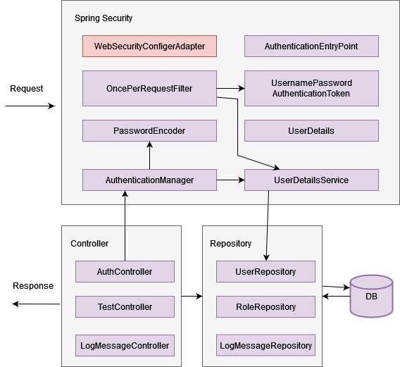

# Tenpo challenge:

```
Los requerimientos son los siguientes:
Debes desarrollar una API REST en Spring Boot utilizando java 11 o superior, con las siguientes funcionalidades:

1.
- a. Sign up usuarios.
- b. Login usuarios.
- c. Debe contener un servicio llamado por api-rest que reciba 2 números, los sume, y le aplique una suba de un porcentaje que debe ser adquirido de un servicio externo (por ejemplo, si el servicio recibe 5 y 5 como valores, y el porcentaje devuelto por el servicio externo es 10, entonces (5 + 5) + 10% = 11). Se deben tener en cuenta las siguientes consideraciones:
  El servicio externo puede ser un mock, tiene que devolver el % sumado.Dado que ese % varía poco, se debe de garantizar que esa información expire cada 30 min.
  Si el servicio externo falla, se debe devolver el último valor retornado. Si no hay valor, debe retornar un error la api.
  Si el servicio externo falla, se puede reintentar hasta 3 veces.
- d. Historial de todos los llamados a todos los endpoint junto con la respuesta en caso de haber sido exitoso. Responder en Json, con data paginada. El guardado del historial de llamadas no debe sumar tiempo al servicio invocado.
- e. El historial y la información de los usuarios se debe almacenar en una database PostgreSQL.
- f. Incluir errores HTTP. Mensajes y descripciones para la serie 4XX.
- g. Salvo el sign_up y login, todos los demas endpoints deben requerir la autenticacion mediante un token JWT
2. Se deben incluir tests unitarios.
3. Esta API debe ser desplegada en un docker container. Este docker puede estar en un docker hub público. La base de datos también debe correr en un contenedor docker. Recomendación usar docker compose
4. Debes agregar un Postman Collection o Swagger para que probemos tu API
5. Tu código debe estar disponible en un repositorio público, junto con las instrucciones de cómo desplegar el servicio y cómo utilizarlo
```

## Technologies:
* Java 11
* SpringBoot
* Lombok
* JPA
* Resilience4j
* Docker
* Controller Advice
* Spring Security - JWT
* Swagger

## External Service - CalculatorService

* URL GitHub -> https://github.com/GonzaloOrellanoCapstone/calculatorService

## Diagrams

* Login flow:



* Login JWT architecture:


## Postman

- Dentro de la carpeta Resources se encuentra la collection de Postman

## Swagger

- http://localhost:8088/swagger-ui/index.html

## Pre requisitos
Ejecutar el siguiente comando en la raiz del proyecto para levantar el servicio:
```bash
$ docker-compose up
```

## Comentarios
- Resilience4j en caso de fallar la API del calculatorService devuelve un valor fijo en 200d.
- getLogMessage devuelve el historial de las llamadas a los endpoints con paginacion. Por defecto si no se le pasa los valores el page = 0 y pageSize = 20.
- Se puede integrar Eureka para registrar todas las instancias de MS que desplegamos.
- Tambien se puede tener un config-server donde vamos a alojar todas las variables de los MS pero por ambiente. Deberiamos de modificar el application.properties a bootstrap.properties donde debemos de indicar el profile activo.
- Dentro del application.properties se dejo un H2 por si se quiere utilizar, solo basta con ejecutar: 
```bash
$ mvn spring-boot:run
```